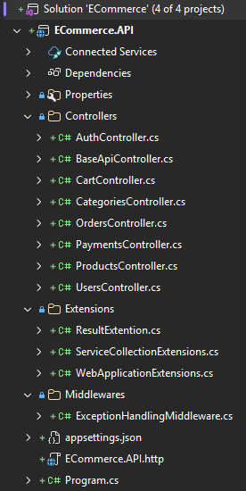
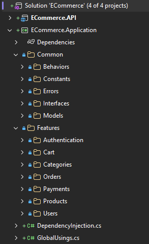
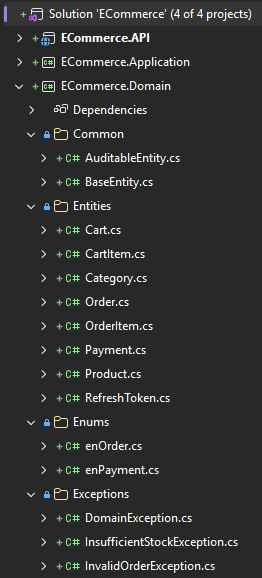
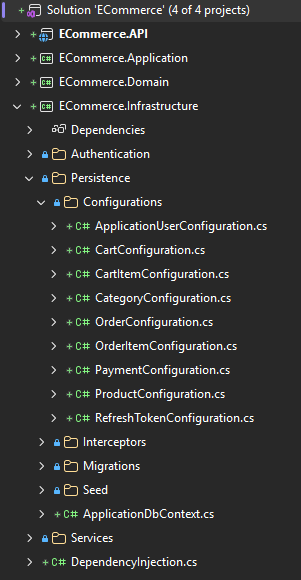
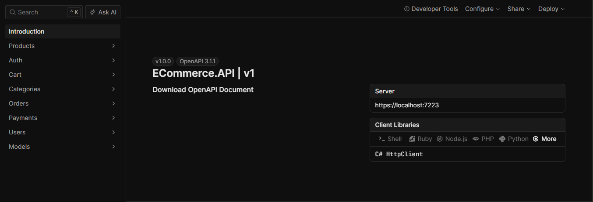
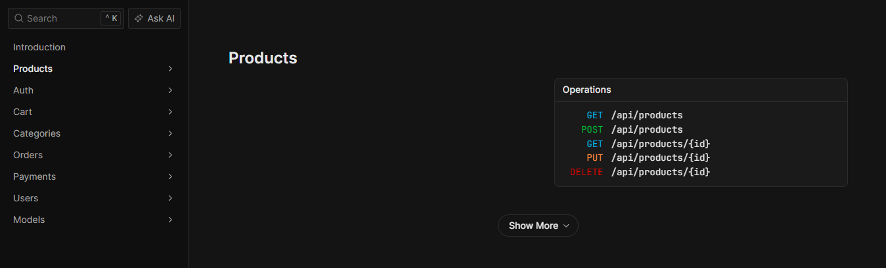
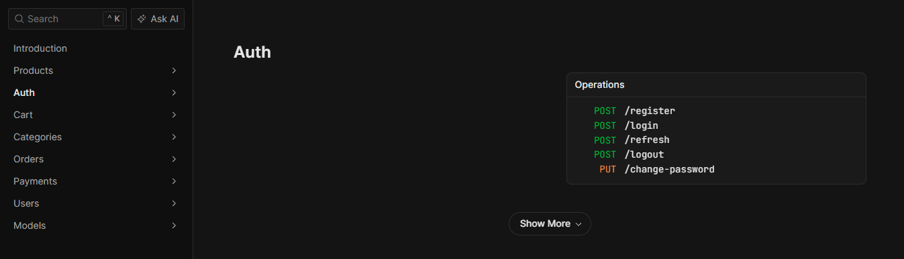
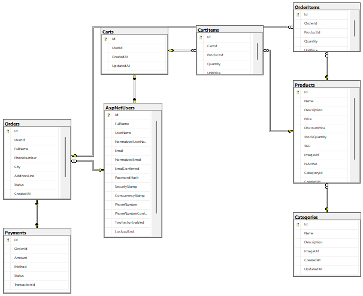

# 🛒 E-Commerce REST API

A production-ready **E-Commerce REST API** built with **ASP.NET Core (.NET 10 LTS)** following **Clean Architecture** principles.

This project demonstrates modern backend development practices including **CQRS**, **MediatR**, **Entity Framework Core**, **SQL Server**, **JWT Authentication**, **ASP.NET Core Identity**, **FluentValidation**, and **OpenAPI**.

> 🚀 This project was built as a portfolio project to showcase backend development skills and software architecture best practices.

---

# ✨ Features

## 🔐 Authentication & Authorization

- User Registration
- User Login
- JWT Access Tokens
- Refresh Tokens
- ASP.NET Core Identity
- Role-Based Authorization (Admin / Customer)

---

## 📦 Products

- Create Product
- Update Product
- Delete Product
- Get Product By Id
- Get All Products
- Search Products
- Pagination
- Category Filtering

---

## 📂 Categories

- Create Category
- Update Category
- Delete Category
- Get Categories

---

## 🛒 Shopping Cart

- Add Product To Cart
- Update Cart Item Quantity
- Remove Item
- View Cart

---

## 📋 Orders

- Create Order
- Get User Orders
- Get Order Details

---

## 💳 Payments

- Create Payment
- Update Payment Status
- Payment History

---

## ⚙️ Other Features

- Global Exception Handling
- Validation using FluentValidation
- CQRS with MediatR
- Clean Architecture
- Dependency Injection
- Repository Pattern
- Entity Framework Core
- SQL Server
- OpenAPI Documentation
- Health Checks
- Response Compression
- Rate Limiting

---

# 🏗️ Architecture

```text
                 Client
                    │
                    ▼
          ECommerce.API
        (Presentation Layer)
                    │
                    ▼
      ECommerce.Application
────────────────────────────────
• CQRS
• MediatR
• Validators
• DTOs
• Interfaces
────────────────────────────────
                    │
                    ▼
        ECommerce.Domain
────────────────────────────────
• Entities
• Enums
• Domain Models
────────────────────────────────
                    │
                    ▼
    ECommerce.Infrastructure
────────────────────────────────
• Entity Framework Core
• SQL Server
• ASP.NET Identity
• JWT Authentication
• Persistence
• Repositories
────────────────────────────────
                    │
                    ▼
              SQL Server
```

---

# 🛠️ Technologies

- ASP.NET Core 10 LTS
- C#
- SQL Server
- Entity Framework Core
- ASP.NET Core Identity
- JWT Authentication
- MediatR
- FluentValidation
- Clean Architecture
- OpenAPI
- Scalar API Explorer

---

# 📂 Project Structure

```text
E-Commerce
│
├── ECommerce.API
├── ECommerce.Application
├── ECommerce.Domain
├── ECommerce.Infrastructure
│
├── E-Commerce.sln
├── README.md
└── LICENSE
```

---

# 📦 Database

Entity Framework Core Migrations are used.

Create the database:

```bash
dotnet ef database update \
--project ECommerce.Infrastructure \
--startup-project ECommerce.API
```

---

# 🚀 Getting Started

## 1. Clone the repository

```bash
git clone https://github.com/abduallahali236-cell/ecommerce-clean-architecture-api.git
```

## 2. Navigate to the project

```bash
cd ecommerce-clean-architecture-api
```

## 3. Restore packages

```bash
dotnet restore
```

## 4. Apply database migrations

```bash
dotnet ef database update \
--project ECommerce.Infrastructure \
--startup-project ECommerce.API
```

## 5. Run the application

```bash
dotnet run --project ECommerce.API
```

---

# 🔑 Default Roles

- **Admin**
- **Customer**

---

# 📖 API Documentation

After running the project, open:

```text
https://localhost:{port}/scalar
```

Example:

```text
https://localhost:5001/scalar
```

---

# 📷 Screenshots

## 📂 Solution Explorer






## 🖥 API Explorer



---

## 📦 Products Endpoint



---

## 🔐 Authentication



---

## 🗄 SQL Server Database



---

# 📁 Main Entities

- User
- Product
- Category
- Cart
- CartItem
- Order
- OrderItem
- Payment
- RefreshToken

---

# 🧪 Features Demonstrated

- JWT Authentication
- Role-Based Authorization
- CRUD Operations
- Search & Filtering
- Pagination
- FluentValidation
- Global Exception Handling
- CQRS Pattern
- Clean Architecture
- Repository Pattern
- Dependency Injection
- Entity Framework Core
- SQL Server

---

# 🔮 Future Improvements

- Product Images
- Product Reviews
- Wishlist
- Email Confirmation
- Password Reset
- Stripe Payment Integration
- Docker Support
- Unit Testing
- Integration Testing
- Redis Caching
- Background Jobs (Hangfire)

---

# 👨‍💻 Author

**Abdullah Ali**

- **GitHub:** https://github.com/abduallahali236-cell
- **LinkedIn:** www.linkedin.com/in/abdullah-ali-431910421

---

# ⭐ Support

If you found this project useful, consider giving it a **⭐ Star** on GitHub.

It helps others discover the project and motivates future improvements.

---

## 📜 License

This project is licensed under the **MIT License**.
